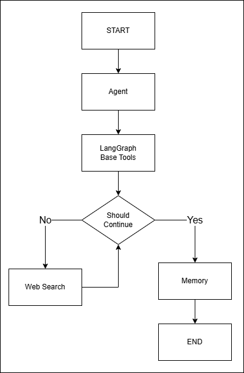
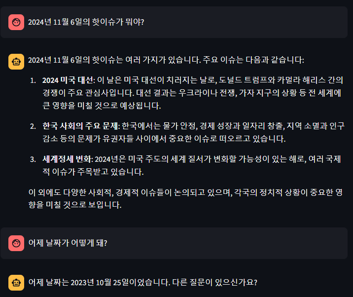
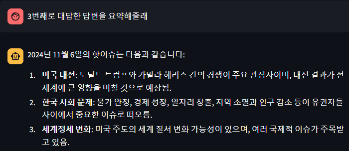
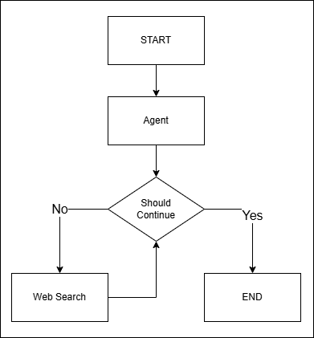
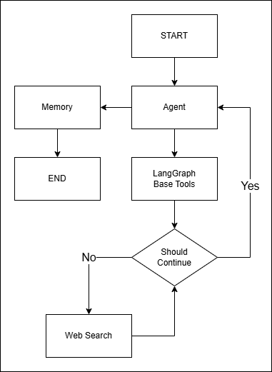
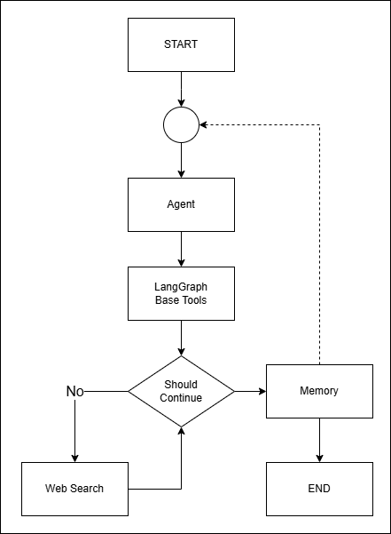
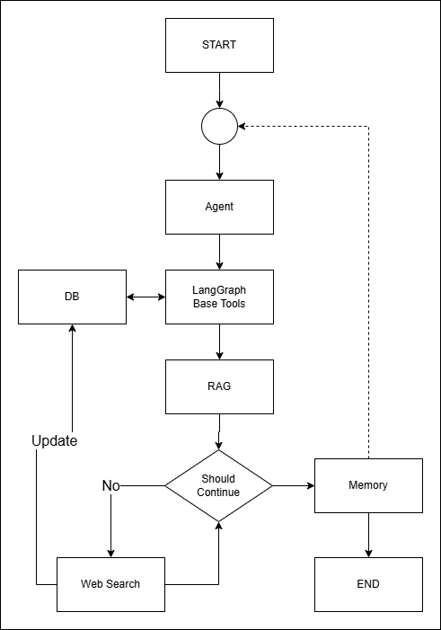
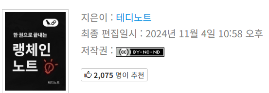

# SKN03-4th-4Team

### Team Name : DocQ

</br>

# 팀원

|  이름  	| 역 할 	|     Github    	|
|:------:	|:-----:	|:------------- 	|
| 김성은 	| 팀장  	| @cocoailjuice     |
| 김종식 	| 팀원  	| @whdtlr98     	|
| 송명신 	| 팀원  	| @SongMyungshin   	|
| 오승민 	| 팀원  	| @artemIntellectus	|
| 유혜린 	| 팀원  	| @Lerini98     	|
| 정해린 	| 팀원  	| @junghl11     	|

</br>
</br>

# LLM을 연동한 내외부 문서 기반 질의응답 시스템

다양한 문서를 대상으로 질의응답을 수행하는 LLM 기반 챗봇입니다. **LangChain** 에이전트를 활용하여 사용자 질문에 대한 정확하고 신속한 답변을 제공합니다.

</br>
</br>

## 목차

- [소개](#소개)
- [기능](#기능)
- [기술 스택](#기술-스택)
- [설치](#설치)
  - [사전 요구 사항](#사전-요구-사항)
  - [로컬 설치](#로컬-설치)
- [사용법](#사용법)
  - [문서 추가](#문서-추가)
  - [서버 실행](#서버-실행)
- [예시](#예시)
  - [Streamlit 사용 예시](#streamlit-사용-예시)
  - [API 사용 예시](#api-사용-예시)
  - [Python 코드에서 사용](#python-코드에서-사용)

</br>
</br>

## 소개

이 프로젝트는 **LangChain** 에이전트를 활용하여 데이터베이스의 내부 및 외부 문서에 대한 질의응답을 처리하는 챗봇을 개발합니다. 대용량의 문서를 효율적으로 처리하고, 사용자에게 정확한 정보를 제공합니다.

</br>
</br>

## 기능

- **문서 인덱싱**: 다양한 형식의 문서를 파싱하고 인덱싱합니다.
- **질의응답**: 사용자의 질문에 대해 문서 내에서 답변을 찾아 제공합니다.
- **자연어 이해**: LLM을 활용하여 자연어로 표현된 질문을 이해합니다.
- **확장성**: 새로운 문서나 데이터 소스를 손쉽게 추가할 수 있습니다.
- **RAG (Retrieval-Augmented Generation)**: LLM이 답변할 수 없는 질문에 대해 검색을 통해 답변을 제공합니다.

</br>
</br>

## 기술 스택


**프로그래밍 언어**: Python 3.12+

**LLM 관련 라이브러리**:

- **LangChain**: LLM을 효과적으로 활용하기 위한 체인과 에이전트 구성
- **LangGraph**: 복잡한 대화 흐름과 그래프 기반의 대화 모델링 지원

**LLM 모델**: OpenAI GPT-4

**기타 라이브러리**:

- **문서 파싱**: `pdfloader`, `docx2txt`
- **토큰화**: HuggingFace 모델 및 토크나이저

</br>
</br>

## 설치

### 사전 요구 사항

- **Python 3.9 이상**
- **OpenAI API 키**: OpenAI GPT-4를 사용하기 위한 API 키가 필요합니다.

### 로컬 설치

1. **저장소를 클론합니다.**

   ```bash
   git clone https://github.com/yourusername/your-repo-name.git
   cd your-repo-name
   ```

2. **가상 환경을 생성하고 활성화합니다.**

   ```bash
   python3 -m venv venv
   source venv/bin/activate
   ```

3. **필요한 패키지를 설치합니다.**

   ```bash
   pip install -r requirements.txt
   ```

   또는 직접 패키지를 설치합니다:

   ```bash
   pip install langchain langgraph pdfloader docx2txt streamlit
   ```

4. **환경 변수를 설정합니다.**

   `.env` 파일을 생성하고 필요한 변수를 설정합니다.

   ```
   OPENAI_API_KEY=your_openai_api_key
   ```

</br>
</br>

## 사용법

### 문서 추가

`data/documents/` 디렉토리에 질의응답에 사용할 문서를 추가합니다. 지원되는 형식은 다음과 같습니다:

- **PDF**
- **Word 문서** (`.docx`)
- **텍스트 파일** (`.txt`)

### 서버 실행

**Streamlit**을 사용하여 애플리케이션을 실행합니다.

```bash
streamlit run main.py
```

또는 **Docker**를 사용하는 경우:

```bash
docker-compose up -d
```

</br>
</br>

## 예시

### Streamlit 사용 예시

Streamlit 웹 애플리케이션에서 질문을 입력하여 답변을 받을 수 있습니다.

**질문 예시**:

```
2021년 매출 보고서를 보여줘
```

**응답 예시**:

```
2021년 매출은 전년 대비 10% 증가하였습니다.
```

### API 사용 예시

RESTful API를 통해 질의응답을 수행할 수 있습니다.

**요청**:

```bash
curl -X POST http://localhost:8000/api/query \
  -H 'Content-Type: application/json' \
  -d '{"question": "회사 소개 자료가 어디 있나요?"}'
```

**응답**:

```json
{
  "answer": "회사 소개 자료는 내부 문서 폴더의 'Company_Overview.pdf'에 있습니다."
}
```

### Python 코드에서 사용

```python
import requests

response = requests.post(
    "http://localhost:8000/api/query",
    json={"question": "신제품 출시 일정이 어떻게 되나요?"}
)

print(response.json()["answer"])
```

---

# 아키텍쳐(저장된 모델)







- 특징:
  - 검색이 필요하면 웹 검색 결과를, 검색이 필요없으면 LLM의 결과가 나옴
    - 검색 필요 여부 판단은 LLM이 판단
  - 단순 모델이라 프롬프트에 따라 결과 퀄리티가 천차만별
  - 과거 이력 메모리 기능 적용
  - 초반 로드에 시간이 걸리는 편이고, 편차가 심한 편
    - 짧으면 1초 내외, 느린 경우엔 10초까지도 걸림
    - 네트워크 환경과, API 인증부분에서 오래 걸리는 것으로 판단됨

</br></br>

# 기초 모델



</br></br>

# 응용 모델



- 특징:
    - 검색 결과에서 적절치 않은 단어, 결과가 있는 경우 검열 처리 가능
    - 구체적인 정보의 제공을 꺼리며, 모호하게 대답
    - 대답 내용이 LLM 기준은 명확하게 작동하나 Web에서 가져온 정보는 매우 엄격한 기준으로 대답을 함.
        - 진위를 알기 어렵다.
        - 팩트 체크가 필요하다.
        - 구체적인 정보는 OO을 방문하라.

</br>



- 특징:
    - 외부(streamlit)에서 적용되던 메모리(Memory)를 node와 LangGraph에 적용한 모델
    - graph compile 선언할 때, memory도 함께 선언
    - 기초 모델에서 코드만 따졌을 때, 많은 차이가 있음
    - Memory node에서 trimming, summary 선택 진행

</br></br>



- 특징:
    - LangChain의 기본 tool을 이용해서 DB 접속
    - RAG를 이용해서 DB 검색 결과 재검색
    - 웹 검색으로 결과 도출 시 DB에 update
        -  DB 형식에 맞게 정보를 수정하거나 내부 state 형식에 맞게 DB를 조정 필요

</br></br>

# Info

</br>

## LangChain update
When we learn LangChain, LangChain version is


When we learn LangGraph, LangChain version is


Now, LangChain version is 


당장 git에 올리기 전에 작동하더라도 이후 업데이트로 작동되지 않을 가능성이 있음

</br>

## LangChain Kor



[LangChain 한국어 튜토리얼 github](https://github.com/teddylee777/langchain-kr)

[LangChain 한국어 튜토리얼 wikidocs](https://wikidocs.net/book/14314)