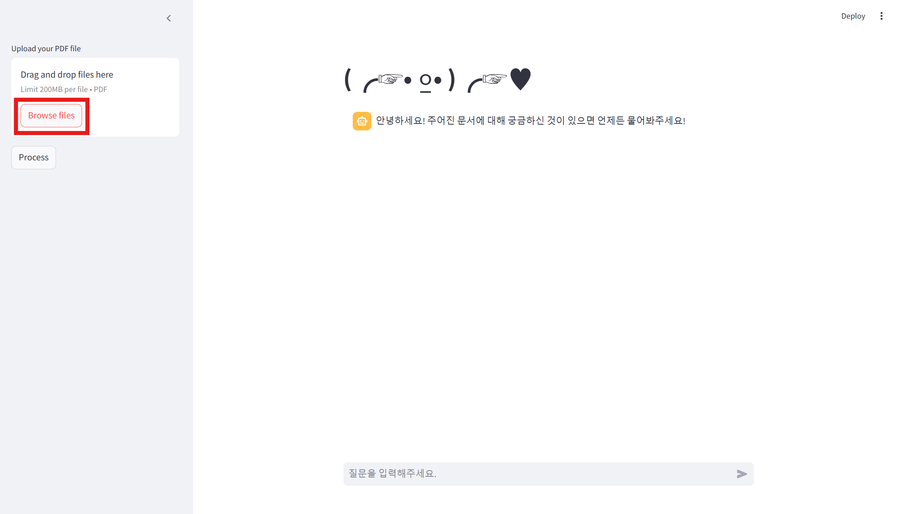
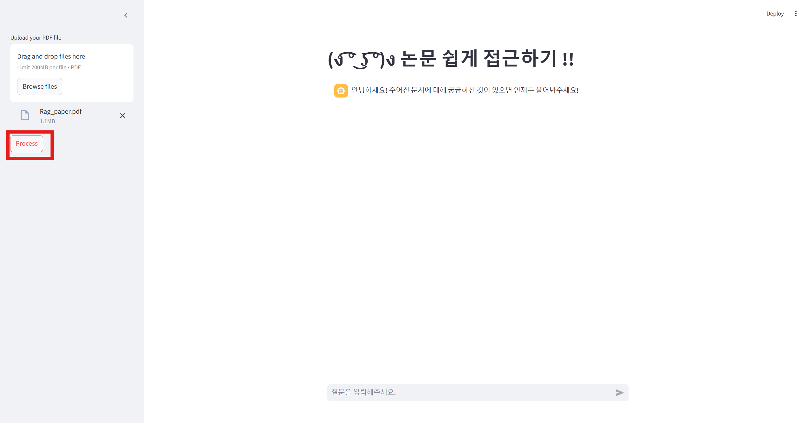
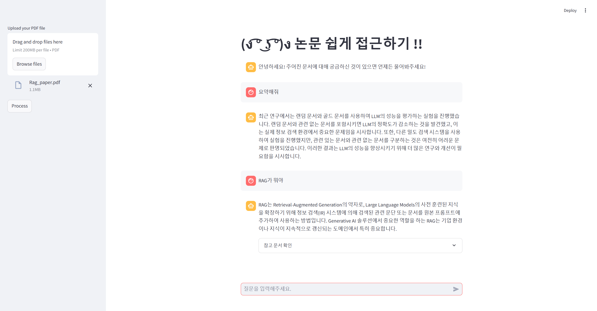

# 문서 기반 대화형 챗봇 시스템

이 프로젝트는 사용자가 업로드한 PDF 문서에서 텍스트를 추출하고, 이를 바탕으로 질문에 대한 AI 기반 챗봇 응답을 제공하는 시스템입니다. **Streamlit**을 사용하여 간단하고 직관적인 UI를 구현하며, **LangChain**을 활용한 대화형 검색 시스템을 구성하여 문서에서 관련 정보를 찾아 실시간으로 답변을 생성합니다.

## 주요 기능

1. **PDF 파일 업로드 및 텍스트 추출**: 사용자가 업로드한 PDF에서 텍스트를 추출
2. **문서 벡터화 및 검색**: 텍스트를 벡터화한 후, **FAISS**를 사용하여 벡터 스토어에 저장하고 이를 통해 문서 검색 기능을 제공
3. **대화형 챗봇**: 대화 체인을 통해 사용자의 질문을 처리하고 관련 문서를 검색하여 답변을 생성하며, 응답과 함께 참고 문서를 제공하여 유용한 정보를 전달

### 📌변경 사항

- 대화 흐름 관리 추가

- 벡터 스토어(Chroma->FAISS)

> pdf 파일이 많아졌을 때를 고려하여 변경

- 대화 체인 구성

> 단순히 RetrievalQA 체인을 생성하여 질문에 답변 -> ConversationalRetrievalChain을 사용하여 대화형으로 질문을 처리할 수 있도록 구성(이 체인은 ConversationBufferMemory를 사용해 대화 이력을 관리하며, MMR (Maximal Marginal Relevance) 검색을 통해 보다 **관련성 높은 응답을 제공**)

- 추가 기능

> tiktoken을 사용하여 텍스트의 토큰 수를 계산하는 기능을 제공합니다. 이를 통해 문서를 효율적으로 청크로 나누고, 대화 흐름을 Streamlit의 대화형 UI로 관리할 수 있도록 개선

## 챗봇 설정 화면

  
  

## 예시 질문

